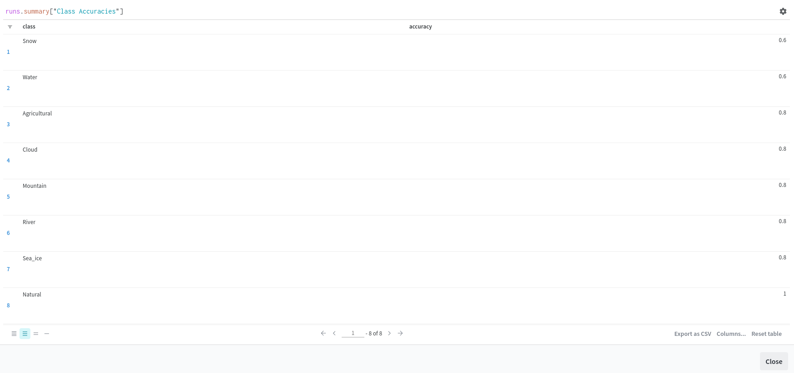

# Few-shot Satellite Image Classification (OPS-SAT)

Welcome to the Few-shot Satellite Image Classification (OPS-SAT) repository Follow the steps below to get started:

## Usage Guide

1. **Clone the Repository:**
    ```bash
    git clone https://github.com/ShendoxParadox/Few-shot-satellite-image-classification-OPS-SAT.git
    ```

2. **Navigate to Repo Root Folder:**
    ```bash
    cd Few-shot-satellite-image-classification-OPS-SAT
    ```

3. **Build Docker Image:**
    ```bash
    docker build --no-cache -t ops_sat:latest .
    ```

4. **Run Docker Container:**
    ```bash
    docker run -it ops_sat
    ```

5. **Modify Configuration:**
    Edit the `config.json` file as needed:
    ```bash
    nano config.json
    ```

6. **Navigate to Source Folder:**
    ```bash
    cd src/
    ```

7. **Run OPS-SAT Development Script:**
    ```bash
    python OPS_SAT_Dev.py
    ```

8. **Choose W&B Option:**
    Follow the prompts to choose the WandB option during script execution.

9. **View Run Results:**
    Navigate to the WandB dashboard to observe the run results.

10. **(Another way) Pull and run the following docker image**
    ```bash
    docker pull ramezshendy/ops_sat:latest
    docker run -it ramezshendy/ops_sat:latest
    ```

For any additional information or troubleshooting, refer to the documentation or contact the repository owner.


## Config file guide:

- **Dataset Name:** The OPS-SAT case dataset
- **Dataset Variation Description:** Augmented Color Corrected Synthetic Variation

### Dataset Paths

- **Training/Validation Dataset Path:** ../Data/Variation_Synthetic_Generation_color_corrected_Augmentation/train/
- **Test Dataset Path:** ../Data/Variation_Synthetic_Generation_color_corrected_Augmentation/test/  
Change the path of the training and test datasets from the available dataset variations in the Data folder.

### Model Configuration

- **Transfer Learning:** false  
Means that the model will utilize pretraining using imagenet. If true, it will use transfer learning techniques.
- **Transfer Learning Dataset:** landuse  
The available transfer learning datasets are: landuse, imagenet, opensurfaces

### Model Parameters
- **Project:** OPS-SAT-Thesis-Project
- **Input Shape:** [200, 200, 3]
- **Number of Classes:** 8
- **Dropout:** 0.5
- **Output Layer Activation:** Softmax
- **Model Optimizer:** Adam
- **Loss Function:** FocalLoss  
The implemented loss functions to use from are: FocalLoss, SparseCategoricalCrossentropy
- **Model Metrics:** [SparseCategoricalAccuracy]
- **Early Stopping:**
  - Monitor: val_sparse_categorical_accuracy
  - Patience: 6
- **Model Checkpoint:**
  - Monitor: val_sparse_categorical_accuracy
- **Cross Validation K-Fold:** 5
- **Number of Epochs:** 200
- **Batch Size:** 4
- **Focal Loss Parameters:**
  - Alpha: 0.2
  - Gamma: 2  
  If loss function is FocalLoss
- **Number of Freeze Layers:** 5  
  If transfer learning is true.

## Supplementary Links

- [ESA OPS-SAT Competition](https://kelvins.esa.int/opssat/home/)
- [Dataset on Zenodo](https://zenodo.org/records/6524750)

## Project Structure

```plaintext
- /OPS-SAT-Thesis-Project
  - /Data
    - /Variation_Synthetic_Generation_color_corrected_Augmentation
      - /train
        - /Agricultural
        - /Cloud
        - /Mountain
        - /Natural
        - /River
        - /Sea_ice
        - /Snow
        - /Water
      - /test
    - /ops_sat
    - /Variation_Augmentation
    - /Variation_Original
    - /Variation_Synthetic_Generation
    - /Variation_Synthetic_Generation_color_corrected
  - /src
    - OPS_SAT_Dev.py
    - color_correction.py
    - image_augmentation.py
    - Your source code files
  - /notebooks
  - /models
    - best_weights.h5
    - fold_1_best_model_weights.h5
    - fold_2_best_model_weights.h5
    - fold_3_best_model_weights.h5
    - fold_4_best_model_weights.h5
    - fold_5_best_model_weights.h5
  - README.md
  - Dockerfile
  - config.json
  - .gitignore
  - requirements.txt


